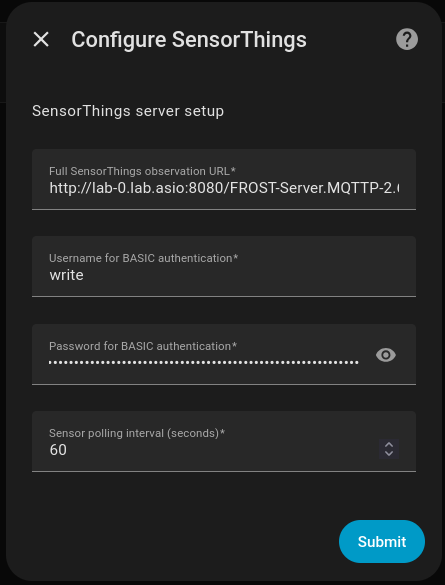
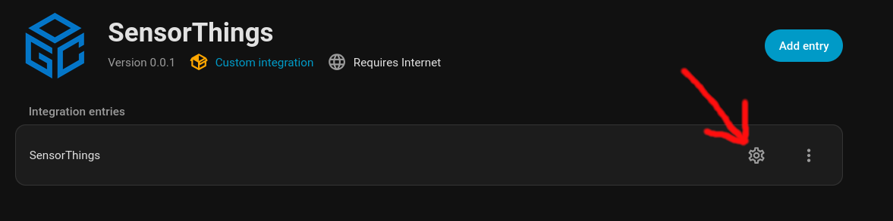
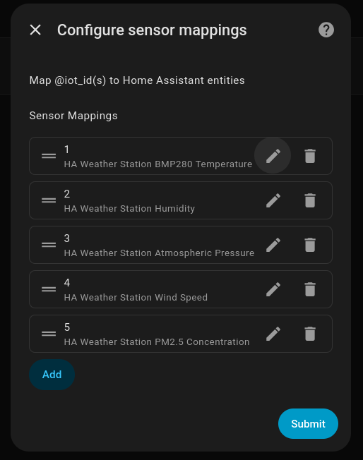
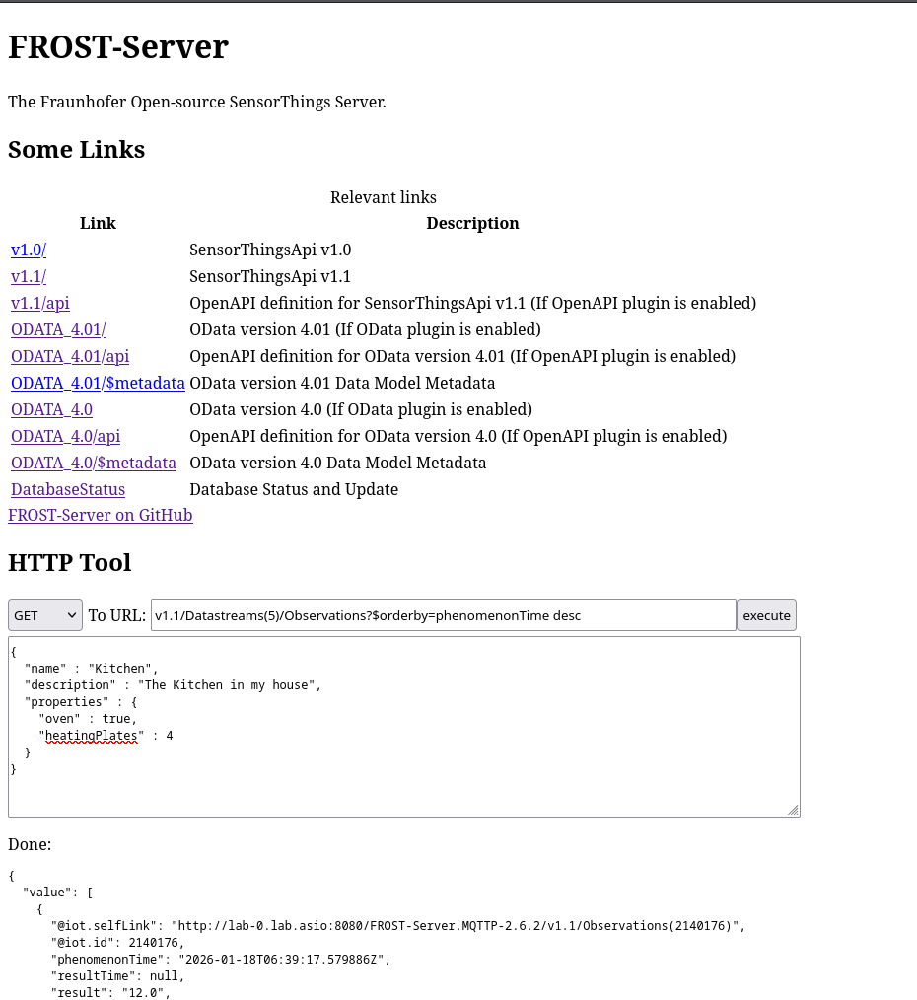

# Home Assistant SensorThings Integration

Submit `Observations` to a SensorThings server from Home Assistant

## Features

* Tested with [FROST Server](https://fraunhoferiosb.github.io/FROST-Server/) version 2.6.2
* Support for BASIC authentication
* Tested with [Makerfabs Weather Station](https://www.makerfabs.com/weather-station-for-home-assistant-esphome.html)

## SensorThings (FROST) server setup

* This integration only sends `Observations`
* You are expected to have already configured an external FROST server on a VM somewhere and registered the required `Datastreams`

I wrote blog posts on how to do this, and of course see the official docs, above:

* [Setting up FROST Server](https://www.declarativesystems.com/2025/11/15/sensorthings-frost-server.html)
* [Registering Datastreams FROST server (for HA Weather Station)](https://www.declarativesystems.com/2025/11/15/sensorthings-rest-api.html)


## Installation (via HACS)

1. Go to HACS → Integrations → ⋮ → Custom repositories.
2. Add: `https://github.com/GeoffWilliams/ha-sensorthings` with category **Integration**.
3. Install **SensorThings Integration**.
4. Restart Home Assistant.
5. Add the integration via *Settings → Devices & Services → Add Integration → SensorThings*.
6. Configure for your SensorThings server:



Note the URL needs to be the full path to the Observations endpoint, eg `http://lab-0.lab.asio:8080/FROST-Server.MQTTP-2.6.2/v1.1/Observations`


## Sensor Mappings

After configuring the SensorThings server, click the cog icon to set the integration options:



You should then add a mapping between each of the `Datastream`s you configured in FROST server and the associated Home Assistant entity, eg:



After clicking submit, sensors will be polled according to the interval you selected (default 60 seconds).

## Checking the integration is working

### In Home Assistant

Enable debug mode for this integration in `configuration.yaml` like this, then restart Home Assistant:

```yaml
logger:
  default: warning
  logs:
    custom_components.sensorthings: debug
```

If observations were submitted correctly, you should see debug log messages like this when you do `Show raw logs`:

```
2026-01-18 17:35:17.534 DEBUG (MainThread) [custom_components.sensorthings] SensorThings Observation POST OK, sent: {'result': '29.8987503051758', 'phenomenonTime': '2026-01-18T06:35:17.519723+00:00', 'Datastream': {'@iot.id': 1}}
2026-01-18 17:35:17.545 DEBUG (MainThread) [custom_components.sensorthings] SensorThings Observation POST OK, sent: {'result': '55.1565170288086', 'phenomenonTime': '2026-01-18T06:35:17.534549+00:00', 'Datastream': {'@iot.id': 2}}
2026-01-18 17:35:17.556 DEBUG (MainThread) [custom_components.sensorthings] SensorThings Observation POST OK, sent: {'result': '1009.06231689453', 'phenomenonTime': '2026-01-18T06:35:17.545712+00:00', 'Datastream': {'@iot.id': 3}}
2026-01-18 17:35:17.567 DEBUG (MainThread) [custom_components.sensorthings] SensorThings Observation POST OK, sent: {'result': '0.0', 'phenomenonTime': '2026-01-18T06:35:17.556812+00:00', 'Datastream': {'@iot.id': 4}}
2026-01-18 17:35:17.578 DEBUG (MainThread) [custom_components.sensorthings] SensorThings Observation POST OK, sent: {'result': '10.0', 'phenomenonTime': '2026-01-18T06:35:17.567815+00:00', 'Datastream': {'@iot.id': 5}}
```

### In FROST server

**Check the access logs**

Should see status 201 messages arriving according to the selected interval:

```shell
# eg...

tail -f /var/log/tomcat11/localhost_access_log.2026-01-18.txt

172.16.0.246 - - [18/Jan/2026:06:02:05 +0000] "POST /FROST-Server.MQTTP-2.6.2/v1.1/Observations HTTP/1.1" 201 -
172.16.0.246 - - [18/Jan/2026:06:02:05 +0000] "POST /FROST-Server.MQTTP-2.6.2/v1.1/Observations HTTP/1.1" 201 -
172.16.0.246 - - [18/Jan/2026:06:02:05 +0000] "POST /FROST-Server.MQTTP-2.6.2/v1.1/Observations HTTP/1.1" 201 -
172.16.0.246 - - [18/Jan/2026:06:02:05 +0000] "POST /FROST-Server.MQTTP-2.6.2/v1.1/Observations HTTP/1.1" 201 -
```

**Recent Observations**

Query the individual datastreams directly, either with the FROST UI:



Or on the commandline with `curl`:

```shell
# pick the datastream you are interested in (@iot_id)
curl 'http://lab-0.lab.asio:8080/FROST-Server.MQTTP-2.6.2/v1.1/Datastreams(5)/Observations?$orderby=phenomenonTime%20desc'| jq | less
```

Output should show the most recent data first, eg:

```
{
  "value": [
    {
      "@iot.selfLink": "http://lab-0.lab.asio:8080/FROST-Server.MQTTP-2.6.2/v1.1/Observations(2140241)",
      "@iot.id": 2140241,
      "phenomenonTime": "2026-01-18T06:52:17.59285Z",
      "resultTime": null,
      "result": "12.0",
      "Datastream@iot.navigationLink": "http://lab-0.lab.asio:8080/FROST-Server.MQTTP-2.6.2/v1.1/Observations(2140241)/Datastream",
      "FeatureOfInterest@iot.navigationLink": "http://lab-0.lab.asio:8080/FROST-Server.MQTTP-2.6.2/v1.1/Observations(2140241)/FeatureOfInterest"
    },
```

If data has recent timestamps, then its working.

Have lots of fun
